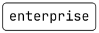
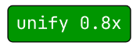

# Documentation
## Design documentation
- Words will be falling through the skies
- Words can have different powerups or actions attached to them
- Increasing difficulity (more points, smaller time limit, less lives, faster word speed)
- Powerups can reduce word speeds, clear all words, multiply points given, ...
- Game ends either when the player does not fulfill the score requirements in time or the player runs out of lives

## Explainations
### Block types
-  Normal block: When destroyed will give the player number of characters * current multiplier points
-  Multiplier block: When destroyed will multiply the current multiplier by the number next to the word
-  Slow block: When destroyed will multiply the block speed by the number next to the word
-  Purge block: When destroyed will remove all blocks from the screen
### Game mechanics
- The player will have to type the words that are falling from the sky in order to fully fill the tank
- After earning points, the water level will rise
- The player will move on to the next level when the tank is full
- The player will lose a life when they misspell a word
- The game ends when the player runs out of lives or the time runs out

## Extensions
- Level system: The game will progressively get harder
- High score system: The game will keep track of the highest score
- Basic fade out animation for the blocks
- Vignette when the player misspells a word
- Sound effects when destroying blocks or misspelling words
- UI that clearly shows the player's score, lives, time left and other miscellaneous information

## Examples
[Demo video](https://www.youtube.com/watch?v=Rtua2dgUqpQ)

## Acknowledgements
- [Word list](https://github.com/monkeytypegame/monkeytype/blob/master/frontend/static/languages/english_5k.json)
- [Click and blip sounds](https://github.com/aradzie/keybr.com/tree/57b69753978e7a4f2f2476d920f5e7c926ea6e8f/packages/keybr-textinput-sounds/assets)
- [JetBrainsMono font](https://www.jetbrains.com/lp/mono/)
- [Rain typing game for inspiration](https://thetypingcat.com/typing-games/rain/hard)

## Source code
[GitHub repository](https://github.com/netsbot/cepwa1) or see the zipped file
[Hosted game on GitHub Pages](https://netsbot.github.io/cepwa1/)

## Running instructions
```
npm install
npm run dev
```